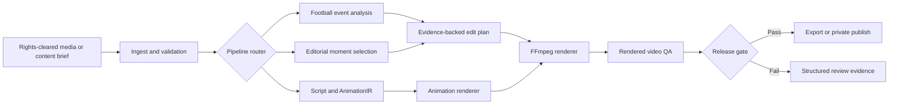

# ShortsEngine

### Evidence-gated AI video production for vertical content

[](https://nodejs.org/)
[](https://ffmpeg.org/)
[](https://playwright.dev/)
[](#project-status)

ShortsEngine is a production-hardening research project for turning source media
or structured ideas into reviewable vertical videos. It combines media analysis,
editorial planning, deterministic rendering, computer-vision-assisted framing and
final-output verification in one local-first system.

The central engineering idea is simple: **an AI pipeline should not report success
because its metadata looks correct; the rendered video must support the claim.**

Built by [Anastasis Chatzedakis](https://github.com/anaschatz), an undergraduate
student in the Department of Management Science and Technology at the Athens
University of Economics and Business.

## At A Glance

| | |
| --- | --- |
| **Problem** | Producing good short-form video repeatedly requires more than finding a loud moment and applying a center crop. |
| **Approach** | Separate evidence collection, editorial decisions, rendering and final visual proof behind explicit contracts. |
| **Primary research track** | Football highlights with scoreboard-aware event discovery, full-phase reconstruction and action-safe reframing. |
| **Additional workflows** | Motivational edits and original narrated animation. |
| **Engineering focus** | Validation, deterministic jobs, safe artifact handling, observability, evaluation and fail-closed release gates. |
| **Current stage** | Strong local prototype and evaluation platform; not yet a finished multi-user SaaS. |

## Product Workflows

### Football highlights

The football pipeline is designed to find candidate match events, build a stable
score timeline, reject disallowed or weakly supported events, reconstruct the live
phase before a goal and verify the final render. Scoreboard OCR is treated as an
anchor, while visual and audio evidence help locate the actual action.

The active research goal is not merely “detect a goal.” It is to show the buildup,
finish, payoff and confirmation while keeping the ball and relevant players visible
in a vertical frame.

### Motivational edits

The editorial pipeline ranks candidate moments, protects sentence boundaries,
generates kinetic captions and records controlled quality experiments against a
saved baseline.

### Original narrated animation

The narrated pipeline turns approved scripts and claims into a frame-addressable
`AnimationIR`, synthesizes narration through an optional local TTS runtime and
renders continuous vector scenes without depending on broadcast or stock footage.

## Why It Is Different

- **Evidence before claims.** A score change, caption or JSON label is not enough
  to prove that a rendered video visibly contains a goal.
- **Fail-closed output gates.** Missing artifacts, unsafe crops, incomplete goal
  coverage and failed renders block export instead of producing misleading success.
- **Domain-specific framing.** Football reframing can follow action evidence and
  fall back to a wider view when tracking confidence is not strong enough.
- **Local-first AI tooling.** Tests and demos use deterministic providers by
  default; optional OCR, transcription, enhancement and TTS runtimes stay behind
  adapters.
- **Quality is measured.** Evaluation fixtures, visual QA, browser smoke tests and
  a baseline-driven research loop turn subjective editing changes into reviewable
  evidence.

## System Architecture



The HTTP layer stays thin. Domain logic, providers, repositories, artifact storage,
jobs and renderers are isolated behind testable boundaries. This keeps external
tools replaceable and prevents API routes from becoming the workflow engine.

## Engineering Highlights

| Area | Implementation |
| --- | --- |
| Media safety | Extension, MIME, signature, size, duration and FFprobe validation before pipeline entry |
| Job lifecycle | Durable state transitions, cancellation, leases, retries, recovery and terminal-state protection |
| Storage | Repository and artifact-store boundaries with path traversal and key validation |
| Football truth | Score-change timeline, evidence fusion, no-false-goal guards and chronological event binding |
| Rendering | FFmpeg/FFprobe adapters, bounded execution, edit-plan validation and export gating |
| Auto-framing | Ball/player/action tracking contracts with conservative wide-safe fallback |
| Enhancement | Managed Python Real-ESRGAN adapter with Apple MPS support and validated output frame counts |
| Transcription | Local Faster-Whisper adapter with word timestamps and deterministic fallback |
| Original animation | Frame-accurate `AnimationIR`, continuous vector rendering and narration alignment |
| Observability | Structured IDs, bounded progress, safe error codes and sanitized readiness reports |
| Verification | Node tests, deterministic evals, Playwright browser checks, visual proofs and release reports |

## Capability Maturity

ShortsEngine is explicit about what is stable and what is still being improved.

| Level | Capabilities |
| --- | --- |
| **Implemented and tested** | Validated local ingest, repository/artifact boundaries, job lifecycle, deterministic providers, FFmpeg rendering, structured errors, evals and browser smoke checks |
| **Operator-enabled** | Authorized YouTube ingest, scoreboard OCR, Faster-Whisper, Real-ESRGAN, local TTS, publishing and cloud-adapter checks |
| **Active product research** | Consistent full-goal recall on varied broadcasts, per-frame ball visibility, scorer tracking, reference-style pacing and larger rights-cleared evaluation sets |

## Quick Start

### Requirements

- Node.js 18 or newer
- npm
- FFmpeg and FFprobe on `PATH`
- Playwright Chromium for browser proof checks

Optional capabilities include `yt-dlp`, OCR, Faster-Whisper, Real-ESRGAN and
Kokoro TTS. The default test path does not require cloud API keys.

```bash
git clone https://github.com/anaschatz/Shorts-Engine.git
cd Shorts-Engine
npm ci
npm run demo:fixture
npm run dev
```

Open [http://localhost:4175](http://localhost:4175). The port can be changed with
`PORT`.

## Validation

Run the core local release checks:

```bash
npm run lint
npm run build
npm test
npm run eval
npm run eval:reference
npm run demo:browser:ci
npm run release:check
```

The repository currently contains 119 focused test files covering validation,
media safety, persistence, jobs, provider contracts, football evidence, rendering,
visual behavior, publishing guards and release workflows.

## Research Workflow

ShortsEngine uses a small-experiment loop for quality changes. Evaluation fixtures
and rubrics remain fixed so an experiment cannot improve its score by changing the
measurement.

```bash
npm run research:short:baseline
npm run research:short -- --description="one scoped quality experiment"
```

Each run reports `keep`, `discard` or `crash`, together with the quality score,
delta, hard-gate failures and guardrail regressions.

## Safe Defaults

- Live YouTube ingest is disabled until an operator explicitly enables it and
  confirms processing rights.
- Tests and the local demo do not require cloud API keys.
- External providers, FFmpeg, OCR, tracking and enhancement stay behind adapters.
- Public errors and reports exclude secrets, raw provider output, storage keys and
  absolute local paths.
- Temporary and partial artifacts are cleaned only inside managed staging areas.
- Exports remain unavailable until rendering and output validation complete.
- Ambiguous content can be routed to human review instead of being guessed.

## Project Structure

```text
server/         API, domain services, jobs, providers, storage and repositories
renderer/       Continuous animation and narrated renderers
tests/          Unit, integration, contract and visual-behavior tests
eval/           Deterministic fixtures, scoring and reference rubrics
demo/           Local proofs, browser checks and human-review tools
tools/          Research, environment, publishing and release utilities
docs/           Architecture, operations, staging and product decisions
shortresearch/  Saved baseline and experiment reports
```

Selected technical documents:

- [Narrated visual shorts architecture](docs/NARRATED_VISUAL_SHORTS_ARCHITECTURE.md)
- [Continuous animation architecture](docs/DARK_CURIOSITY_ANIMATION_ARCHITECTURE.md)
- [Growth pipeline architecture](docs/BUDGET_FRIENDLY_GROWTH_ARCHITECTURE.md)
- [Production beta plan](docs/PRODUCTION_BETA.md)
- [Environment reference](docs/ENVIRONMENT.md)
- [Release process](docs/RELEASE.md)
- [YouTube publishing guide](docs/YOUTUBE_PUBLISHING.md)

## Project Status

ShortsEngine is a **production-hardening prototype and applied AI research
project**, not a finished commercial product.

The engineering platform is broad and well tested, but live football broadcasts
remain a difficult open problem: scorebugs vary, camera direction changes rapidly,
the ball is small, and a correct data record does not guarantee a human-visible
result. The project therefore keeps strict visual gates and records failures rather
than claiming universal highlight accuracy.

Next milestones:

1. Evaluate goal recall and visible phase coverage on a larger rights-cleared set.
2. Improve broadcast-independent scorebug localization and temporal OCR stability.
3. Strengthen ball/scorer tracking without aggressive or distracting crop motion.
4. Add PostgreSQL, durable queues and object storage for real multi-user operation.
5. Measure edit-free pass rate, render reliability, latency and cost per video.

## What This Project Demonstrates

- Designing backend boundaries for unreliable AI and media tools.
- Building asynchronous workflows with recovery, idempotency and safe failure.
- Combining OCR, audio, vision and timeline evidence without overclaiming certainty.
- Testing subjective visual output with deterministic metrics and human review.
- Turning product risks into explicit contracts, observability and release gates.
- Balancing technical ambition with rights, provenance and operational constraints.

## Author

**Anastasis Chatzedakis**<br>
Undergraduate student, Department of Management Science and Technology<br>
Athens University of Economics and Business

- GitHub: [@anaschatz](https://github.com/anaschatz)
- Email: [t8240165@aueb.gr](mailto:t8240165@aueb.gr)

---

Built in Athens as a student project about AI systems, media operations and product
engineering.
