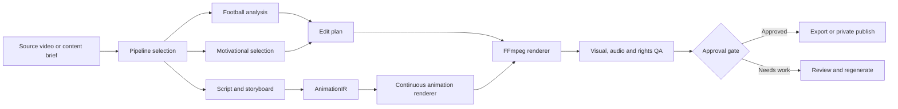

# ShortsEngine

### An AI-assisted production engine for vertical video

[](https://nodejs.org/)
[](https://ffmpeg.org/)
[](https://playwright.dev/)
[](#project-status)

ShortsEngine turns source media or structured ideas into polished, quality-checked
vertical videos. It currently supports three distinct production workflows:

- **Football Shorts** that detect and reconstruct match moments, preserve every
  counted goal, track the action and protect ball visibility during reframing.
- **Motivational Shorts** that select strong moments, build fast editorial cuts,
  generate kinetic typography and package controlled content experiments.
- **Original Animated Shorts** built from scripts, narration and deterministic
  vector scenes, without requiring broadcast or stock footage.

The project was designed and built by
[Anastasis Chatzedakis](https://github.com/anaschatz), a second-year student in
the **Department of Management Science and Technology (DET)** at the
**Athens University of Economics and Business (AUEB)**.

> This is not only a video-editing experiment. It is an engineering project about
> turning uncertain AI and media inputs into reproducible, reviewable outputs.

## Why I Built It

Creating a good Short is easy once. Creating good Shorts repeatedly is a systems
problem.

ShortsEngine explores that problem end to end: media analysis, editorial
decision-making, deterministic rendering, visual verification, rights-aware
publishing and measurable feedback. Building it as a second-year DET student
allowed me to combine software engineering with operations, product thinking,
analytics and process design.

## Production Workflows

| Workflow | Input | What the engine does | Output |
| --- | --- | --- | --- |
| Football highlights | Rights-cleared match video | Detects goal evidence, rejects disallowed/replay-only events, reconstructs the complete goal phase, follows the action and verifies the final render | A goal-complete 9:16 highlight Short |
| Motivational edits | Rights-cleared interview or podcast source | Ranks candidate moments, preserves semantic boundaries, applies a controlled editorial style and records experiment metadata | A fast, branded motivational Short |
| Original animation | Approved brief, claims and narration | Compiles a storyboard and frame-accurate `AnimationIR`, renders continuous vector motion and combines voice, captions and audio | An original narrated animated Short |

## Highlights

- Football-aware event analysis with counted-goal, offside, replay and celebration
  evidence gates.
- Ball-safe reframing with a full-frame fallback when a crop cannot prove
  per-frame ball visibility.
- FFmpeg rendering, media probing and final MP4 validation.
- Optional Real-ESRGAN enhancement that runs automatically when the local runtime
  is available.
- Automatic local Faster-Whisper transcription with word timestamps and a safe
  fallback when the model is unavailable.
- Kinetic captions, narration alignment and audio normalization.
- Continuous, frame-addressable 2D animation through an engine-owned
  `AnimationIR` and a pinned HyperFrames provider.
- Durable jobs, leases, cancellation, recovery, idempotency and artifact storage.
- Human approval gates for ambiguous content and private-by-default YouTube
  publishing workflows.
- Automated visual QA, contact sheets, evaluation suites and release evidence.
- A local autoresearch loop for testing scoped quality improvements against a
  saved baseline.

## How It Works



The workflows share infrastructure, but their domain logic remains isolated.
Football analysis does not leak into generated animation, and renderer-specific
APIs do not leak into approved content artifacts.

## Engineering Decisions

### Fail closed

The engine does not report success when it cannot verify the output. A missing
goal, unreadable source, unproven crop, invalid artifact or failed render blocks
the release and returns a reviewable reason.

### Deterministic rendering

Approved inputs, versions, hashes and a fixed seed produce a traceable render.
Animation timing is stored in integer frames, while important intermediate stages
are preserved as versioned artifacts.

### Human judgment where it matters

Automation handles repetitive analysis and validation. Content approval,
ambiguous goals, factual claims and publication remain explicit human decisions.

### Rights-aware by design

YouTube ingest is disabled by default and requires operator confirmation for
authorized material. Original animation provides a separate workflow that does
not depend on third-party broadcast footage.

## Tech Stack

| Area | Technology |
| --- | --- |
| Application and orchestration | Node.js, CommonJS and ES modules |
| Media processing | FFmpeg, FFprobe |
| Browser and visual QA | Playwright, Chromium |
| Continuous animation | HyperFrames, HTML, SVG and Canvas |
| Transcription and alignment | Faster-Whisper, optional local Python runtimes |
| Voice generation | Kokoro TTS integration |
| Video enhancement | Real-ESRGAN NCNN Vulkan, optional |
| Persistence and storage | Repository adapters, SQLite/local storage, S3-shaped adapters |
| Publishing | YouTube Data API via `google-api-python-client` |
| Testing | Node test runner, deterministic evaluation fixtures, visual proof tools |

## Quick Start

### Requirements

- Node.js 18 or newer
- npm
- FFmpeg and FFprobe on `PATH`
- Playwright Chromium for browser proof checks

Optional local capabilities include `yt-dlp`, Faster-Whisper, Kokoro TTS,
Real-ESRGAN and OCR. The default test path does not require cloud API keys.

### Run locally

```bash
git clone https://github.com/anaschatz/Shorts-Engine.git
cd Shorts-Engine
npm install
npm run demo:fixture
npm run dev
```

Open [http://localhost:4175](http://localhost:4175). Set `PORT` to use a
different port.

### Validate the engine

```bash
npm run lint
npm run build
npm test
npm run eval
npm run eval:reference
npm run demo:browser:ci
npm run release:check
```

The repository contains more than 120 focused test files covering media safety,
goal evidence, rendering, recovery, narrated content, animation timing,
publishing guards and release behavior.

## Automatic Local Capabilities

### Video enhancement

When the official `realesrgan-ncnn-vulkan` binary and its models are installed,
the renderer automatically enhances the caption-free visual layer before final
composition. OCR, tracking and goal verification continue to use the original
source so enhancement cannot alter their evidence.

### Transcription

Faster-Whisper is detected locally through Python. If its configured model is
already cached, the engine uses word-level timestamps for captions. It never
downloads a model during a render.

### Quality research

The autoresearch workflow runs one scoped experiment at a time and compares it
with a saved baseline:

```bash
npm run research:short:baseline
npm run research:short -- --description="describe one focused experiment"
```

It combines deterministic evaluation, reference review and domain tests before
recommending whether a change should be kept.

## Project Structure

```text
server/        API, pipelines, jobs, providers, storage and domain logic
renderer/      Narrated and continuous-animation renderers
tests/         Unit, integration, contract and visual-behavior tests
eval/          Deterministic evaluation fixtures and quality rubrics
demo/          Local proofs, browser checks and human-review tooling
tools/         Research, publishing, environment and release utilities
docs/          Architecture, operations, staging and product decisions
shortresearch/ Local quality baseline and experiment history
```

Useful technical documents:

- [Narrated visual architecture](docs/NARRATED_VISUAL_SHORTS_ARCHITECTURE.md)
- [Continuous animation architecture](docs/DARK_CURIOSITY_ANIMATION_ARCHITECTURE.md)
- [Motivational growth architecture](docs/BUDGET_FRIENDLY_GROWTH_ARCHITECTURE.md)
- [Production beta plan](docs/PRODUCTION_BETA.md)
- [Environment reference](docs/ENVIRONMENT.md)
- [YouTube publishing guide](docs/YOUTUBE_PUBLISHING.md)

## Project Status

ShortsEngine is a **production-hardening prototype**, not a finished multi-user
SaaS.

The local engine already includes separate clip and narrated pipelines,
deterministic rendering, automated QA, persistence boundaries and guarded
publishing tools. The next production milestones are:

- PostgreSQL for real multi-user deployment.
- Durable cloud queues and object storage.
- Account-based authentication and authorization.
- A stronger review interface for ambiguous football moments.
- Production metrics for edit-free pass rate, false-goal rate, render failure
  rate and cost per video.
- Evaluation on larger rights-cleared datasets and real audience feedback.

## Portfolio Notes

This project demonstrates work across:

- backend architecture and API boundaries;
- asynchronous job processing and failure recovery;
- computer vision and media-processing pipelines;
- deterministic graphics and animation systems;
- test design for subjective, visual output;
- product analytics and controlled experimentation;
- safety, provenance and rights-aware release workflows.

The most important lesson from ShortsEngine has been that useful AI products need
more than a good model call. They need contracts, evidence, fallbacks, observability
and a clear place for human judgment.

## Author

**Anastasis Chatzedakis**<br>
Second-year student, Department of Management Science and Technology (DET)<br>
Athens University of Economics and Business (AUEB)

- GitHub: [@anaschatz](https://github.com/anaschatz)
- Email: [t8240165@aueb.gr](mailto:t8240165@aueb.gr)

---

Built in Athens while studying how technology, operations and product decisions
come together in real systems.
