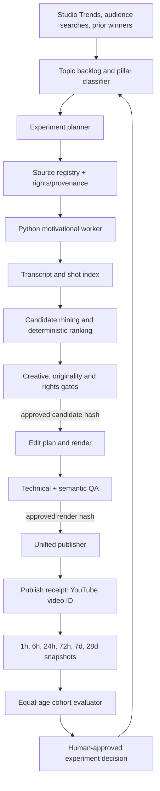
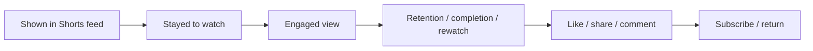

# Budget Friendly Shorts — Growth Architecture & 90-Day Plan

**Snapshot:** 16 July 2026

**Channel:** [Budget Friendly](https://www.youtube.com/@BudgetFriendlyShorts)

**Engine:** `anaschatz/Shorts-Engine` at local commit `9046360`

## Σύνοψη στα ελληνικά

Το κανάλι **δεν έχει πρόβλημα πρόσβασης στο Shorts feed**. Έχει πρόβλημα επαναληψιμότητας και μετατροπής των περαστικών viewers σε κοινό:

- 98 Shorts, 60 subscribers και περίπου 86,1K δημόσια lifetime views.
- Τα 4 από τα 5 νέα Shorts έφτασαν γρήγορα περίπου 1,2K–2,6K views μετά από παύση 13 μηνών.
- Το βασικό leak είναι το appeal: μόνο 44,5% μένει, ενώ 55,5% κάνει swipe.
- Όταν ο viewer μείνει, τα καλύτερα νέα Shorts κρατούν περίπου 80–86% της διάρκειας. Άρα προτεραιότητα είναι το πρώτο frame και η πρώτη φράση.
- Τα discipline/work και identity/growth θέματα έχουν πολύ καλύτερο ιστορικό median από τα γενικά finance/business θέματα.
- Ταυτόχρονα uploads, διαφορετικά caption/crop styles και ασαφές positioning εμποδίζουν καθαρά experiments.
- Τα απλά podcast excerpts έχουν ρίσκο copyright/reused-content και αδύναμη μετατροπή σε subscribers.

Η προτεινόμενη πορεία είναι:

1. Σταθερό `bf_editorial_inset_v1` format με `motivational_tension_micro_v1`: 10–18s, μαύρο 9:16 canvas, centered rounded 16:9 inset, monochrome εικόνα και kinetic typography.
2. Ένα upload τη φορά, 5 την εβδομάδα, με snapshots στις 24h/72h/7d/28d.
3. Test 30 Shorts σε 3 cohorts: contradiction hooks, concrete rules και identity/stakes.
4. Βελτιστοποίηση σε stayed-to-watch, engaged views, retention, shares/comments και subscribers ανά 1.000 engaged views—όχι μόνο raw views.
5. Μετατροπή του engine σε feedback loop: approved candidate → render hash → publish receipt → analytics → cohort decision.
6. Σταδιακή μετάβαση σε original “Budget Friendly Breakdown” format με δικό σου script/voice/οπτική.

Στόχος των πρώτων 90 ημερών είναι να ανέβει το median stayed-to-watch από 44,5% σε τουλάχιστον 50%, να διατηρηθεί ≥80% average viewed στα 10–18s Shorts και να διπλασιαστεί περίπου το subscriber conversion ανά engaged viewer.

## Executive decision

The channel does not need a higher-output video factory. It needs a **closed-loop learning system** that can answer, for every published Short:

1. Why did people stop or swipe?
2. Where did engaged viewers leave?
3. Which topic, hook and format produced shares or subscribers?
4. Can that result be repeated without creating near-duplicate or reused content?

The immediate strategy is:

- keep the current comeback active—the first results are promising;
- publish one controlled Short at a time instead of near-simultaneous pairs;
- freeze one production baseline and test **content**, not five variables at once;
- focus the channel around **discipline that improves money, work and life**;
- add analytics, rights, originality and experiment artifacts to the engine;
- gradually move from captioned celebrity clips to original editorial micro-learning.

This is not an “algorithm hack”. YouTube documents that Shorts ranking uses whether the viewer chose to watch, average view duration, average percentage viewed and satisfaction signals. It does not require a minimum upload cadence. See [YouTube Shorts discovery guidance](https://support.google.com/youtube/answer/11914225?hl=en) and [content-performance guidance](https://support.google.com/youtube/answer/16559650?hl=en).

### Implementation status — 17 July 2026

The architecture is now implemented locally, not merely specified:

- explicit `motivational_tension_micro_v1`, `bf_editorial_inset_v1`, and `bf_viral_micro_v1` contracts;
- deterministic micro-candidate ranking and zero-artificial-cut enforcement;
- selection-only discovery that seals the ranking/source/profile contract before any candidate render;
- 1080×1920/30fps editorial renderer with monochrome rounded inset, kinetic type and `BF.` tail;
- encoded visual, timeline, cut and audio QA, bound to the exact output hash;
- sealed candidate approval, experiment, rights/attribution, originality, render, publish and analytics artifacts;
- private-by-default, channel-bound publisher with durable pending/uploaded receipts,
  crash reconciliation, and a same-video private→public release receipt;
- Node `motivational_source_short` registry/control-plane boundary. Its bundled Python bridge is
  intentionally discovery-only and the generic production handler fails closed; production can
  be registered only through an explicitly injected handler that returns the full sealed artifact
  chain. Until that bridge is supplied, the reviewed Python operator workflow is the production path;
- an operator CLI and end-to-end runbook in `docs/BUDGET_FRIENDLY_IMPLEMENTATION_RUNBOOK.md`.

Three local private proof renders pass all automated gates. Their current sealed report is
`AI-Youtube-Shorts-Generator/output/bf-editorial-proof-2026-07-16/proof-report.json`.
No YouTube upload or public release was performed during implementation.

---

## 1. Channel audit

### 1.1 Public lifetime snapshot

| Metric | Snapshot |
| --- | ---: |
| Subscribers | 60 |
| Shorts | 98 |
| Approx. public lifetime views | 86,121 |
| Mean views per Short | 879 |
| Median views per Short, including no-view entries | 676 |
| 25th / 75th percentile | 404 / 1,200 |
| Shorts with at least 1,000 views | 38 / 98 |
| Shorts below 100 views | 17 / 98 |
| Shorts below 10 views | 11 / 98 |
| Share of views from top 3 Shorts | 19.7% |
| Share of views from top 10 Shorts | 34.0% |

The distribution is uneven, but it proves the channel is capable of receiving Shorts-feed distribution. There is no evidence here of a channel-wide “shadow ban”. The problem is repeatability.

Top public examples at the snapshot:

- [Discipline Is The KEY to FREEDOM!](https://www.youtube.com/shorts/S89eRAQKvK8): ~8.6K
- [True Intelligence Is Getting What You Want!](https://www.youtube.com/shorts/BNk4Y_dev5I): ~4.3K
- [How PRIDE prevents GROWTH!](https://www.youtube.com/shorts/W8aRpOJHiDA): ~4.1K
- [Doing LESS Is the Key to CONSISTENCY!](https://www.youtube.com/shorts/aUFxgZgO5m0): ~2.6K

### 1.2 Current comeback: Studio snapshot

The channel was inactive for roughly 13 months, then published five Shorts from 13–16 July 2026. Four of the five reached roughly 1.2K–2.6K views quickly. Their median public view count was about **1,375**, versus the lifetime median of 676.

For the latest 28-day Studio window:

| Funnel stage | Observed value |
| --- | ---: |
| Raw Shorts views | 6,634 |
| Engaged views | ~2,800 |
| Watch time | 14.7 hours |
| Likes | 83 |
| Subscribers attributed to Shorts | +6 |
| Net channel subscribers | +4 |
| Stayed to watch | 44.5% |
| Swiped away | 55.5% |
| Traffic from Shorts feed | 95.1% |
| YouTube Search | 1.7% |

Directional rates:

- likes per engaged view: about **3.0%**;
- gross subscribers per 1,000 engaged views: about **2.1**;
- recent Shorts have virtually no comments.

Raw Shorts views changed definition on 31 March 2025 and now count starts/replays without a minimum watch time. **Engaged views**, chose-to-view/stayed-to-watch and retention should therefore be the primary optimization metrics, not raw views alone. See [YouTube’s Shorts view-count explanation](https://support.google.com/youtube/answer/10059070?hl=en-GB) and [Shorts analytics metrics](https://support.google.com/youtube/answer/12220281?hl=en).

### 1.3 What the two recent winners reveal

| Short | Length | Raw views | Engaged views | Avg. duration | Stayed to watch | Diagnosis |
| --- | ---: | ---: | ---: | ---: | ---: | --- |
| Doing LESS Is the Key to CONSISTENCY! | 20s | ~2.6K | ~1.2K | 16s | 49.7% | Best current appeal; strong contradiction; ~80% watch among engaged viewers |
| A Good Man Is Not a Nice Guy | 21s | ~1.5K | 577 | 18s | 40.6% | Weaker stop rate but ~86% watch among those who stayed; Studio reports unusually high sharing |

The conclusion is important: **retention after the viewer commits is already respectable. The largest leak is before that—topic, opening frame and opening sentence.**

The same-day zero-view Short, `Being a Good Man Is Harder Than Being Nice`, was 35 seconds long and its visible opening words were fragmented (“Good,” / “or”), rather than a complete premise. It is too new to declare a failure before the 72-hour snapshot, but it is a clear creative-risk example.

### 1.4 Topic fit

A rough, title-keyword classification gives a directional signal:

| Pillar | Shorts | Median views | Mean views | At least 1K |
| --- | ---: | ---: | ---: | ---: |
| Money / investing / business | 27 | 425 | 454 | 4 |
| Discipline / work / habits | 17 | 1,200 | 1,630 | 13 |
| Identity / growth / failure | 30 | 1,000 | 1,046 | 16 |

This is not causal analysis: video age, speaker fame, source quality and format are confounders. It is nevertheless strong enough to reject the current assumption that generic finance titles are the channel’s best growth engine.

The current positioning is blurred:

- the name and description promise finance plus mental tips;
- the feed mostly delivers generic motivation, masculinity, discipline and celebrity podcast excerpts;
- a viewer can enjoy one clip without understanding why they should subscribe to **Budget Friendly**.

### 1.5 Packaging and visual consistency

Observed issues:

- The banner is almost entirely black and does not state the channel promise.
- The avatar is small text and an emoji; it is difficult to recognize at Shorts-feed size.
- Some Shorts use a full-frame 9:16 close-up; others merely letterbox a small 16:9 clip. Neither consistently implements the deliberate centered, rounded, monochrome editorial inset now selected as the target.
- Caption systems vary from large readable phrases to tiny word-by-word or cursive text.
- Many titles are generic imperatives or “How…” titles. The strongest titles use a clear conflict or paradox.
- Recent descriptions are much better: they identify the speaker, summarize the idea and link the source.
- No related video was set on the inspected recent winner.
- The current five-video wave was published in pairs separated by only 14–45 seconds. This does not prove cannibalization, but it prevents clean experiments.

---

## 2. Content strategy

### 2.1 Channel promise

Recommended promise:

> **Practical discipline for better money, work and life—in under 30 seconds.**

This preserves the Budget Friendly identity while following the topics the audience has already rewarded. It also creates a reason to subscribe: each Short is another actionable rule, not simply another celebrity quote.

Recommended content mix for the first controlled experiment:

- **50% Discipline → freedom:** consistency, focus, work systems, impulse control.
- **30% Identity → decisions:** boundaries, failure, responsibility, confidence.
- **20% Practical money behavior:** spending rules, investing behavior, earning skills; every Short must contain a specific action, number or decision rule.

Avoid vague finance clips such as “the truth about money” unless the idea contains a concrete mechanism or surprising rule.

### 2.2 Repeatable series

Use three recognizable series, without logo intros:

1. **The Discipline Paradox** — “Doing less can make you more consistent.”
2. **One Rule for Better Money** — “Wait 24 hours before any unplanned purchase over €50.”
3. **Identity Decisions** — “A good person seeks approval; a principled person protects a standard.”

The series label should be a small, consistent visual element—not a pre-roll card. The first frame must still deliver the hook.

### 2.3 Creative control profile

The user-designated visual reference is the 4.2M-view [Leysath Lab Reel “Before you win”](https://www.instagram.com/leysathlab/reel/DYkFjyFty5s/). The account’s public feed exposed 41 Reels with roughly 44.93M plays and a median of about 137K. Its repeatable grammar is documented in `docs/LEYSATH_EDITORIAL_STYLE_SPEC.md`.

Freeze `bf_editorial_inset_v1` with `motivational_tension_micro_v1` for the first controlled experiment. Keep the existing `budget_friendly_v2` behavior unchanged as a legacy control:

| Variable | Control |
| --- | --- |
| Duration | Preferred 10–18 seconds; hard range 8–22 seconds |
| First spoken value | Starts immediately; no greeting, attribution or filler |
| First-frame text | Visible by 0.25s; semantic hero word completes by about 0.6s |
| Structure | tension hook → compact contrast → pause/reaction payoff |
| Speaker | One main speaker |
| Cuts | Preserve 0–2 genuine source/reaction cuts; 0 generated cuts |
| Composition | Black 9:16 canvas; centered rounded 16:9 source inset at about 94% width |
| Grade | High-contrast monochrome with restrained vignette |
| Typography | Kinetic phrase graphics, 1–4 words, one 1.6–2.4× hero word, inside inset |
| Music | Licensed low bed under dominant speech; exact mix is versioned |
| Branding | No intro; original `BF.` tail, 0.2–0.4s for YouTube |
| Ending | Semantically complete; no cut mid-thought |
| Related video | Required: next episode or strongest relevant Short |

The full geometry, timing, typography, audio, QA and renderer mapping are in `docs/LEYSATH_EDITORIAL_STYLE_SPEC.md`. This replaces the earlier full-frame/lower-third production recommendation; the analytics architecture and content-cohort logic remain unchanged.

### 2.4 Hook gate

A candidate cannot enter rendering unless all are true:

- the premise is understandable without the host’s previous question;
- the first meaningful word and visible text begin by 0.25 seconds;
- the first 0.6–0.8 seconds establish a conflict, concrete result, identity stake or curiosity gap;
- no opening with “yeah”, “I think”, “as I said”, a pronoun without context or speaker attribution;
- title, first-frame claim and final payoff describe the same idea;
- the payoff is present inside the selected boundaries;
- the clip is materially different from recently published scripts and hooks.

Examples of useful hook families:

- **Contradiction:** “Discipline gives you freedom.”
- **Cost:** “Motivation is why you keep quitting.”
- **Specific rule:** “Use this 24-hour spending rule.”
- **Identity:** “Nice people seek approval. Good people keep standards.”
- **Open loop with a promised answer:** “The richest habit costs nothing.”

### 2.5 Originality and monetizable IP

The current format is mostly podcast footage plus captions/crop. Source attribution is good practice, but it is not a license and does not by itself make content original. YouTube’s channel-wide monetization policy can reject mass-produced templates or reused content without substantial original commentary or modification. See [YouTube channel monetization policies](https://support.google.com/youtube/answer/1311392?hl=en).

Run two production lanes:

- **Control lane:** only rights-cleared source clips, used to learn hook and topic performance.
- **Original-IP lane:** original script, stable channel voice/persona, original analysis and licensed/original visuals. The source idea may be cited, but the Short must express Budget Friendly’s own argument and example.

Target the original-IP lane to become the majority format by day 90. This improves defensibility, subscriber conversion and future monetization.

---

## 3. Engine audit

### 3.1 Current state

The repository has two partially separate systems:

1. The main Node.js modular monolith owns jobs, leases, artifacts, approvals, rights-related guards, publishing state and recovery.
2. `AI-Youtube-Shorts-Generator/` contains the actual motivational Python pipeline: ingest, transcription, candidate mining, ranker, crop, captions, QA and a second uploader.

The Python selection layer is already useful. The missing capability is a durable connection from:

> approved candidate → exact render → upload receipt → YouTube video ID → equal-age analytics → experiment decision

Concrete gaps:

- Main registry only recognizes `clip` and `narrated_short`: `server/pipelines/pipeline-registry.cjs`.
- The narrated vertical registry knows football and Dark Curiosity, not Budget Friendly: `server/pipelines/narrated-short/vertical-registry.cjs`.
- Background music exists as a generic motivational default rather than an explicit, licensed and versioned Leysath-style audio treatment with documented ducking and mix targets: `AI-Youtube-Shorts-Generator/shorts_generator/profiles.py` and `config.py`.
- The renderer contains both full-height editorial logic and centered-inset primitives. The selected geometry, monochrome grade, kinetic typography and platform-specific brand tail need an explicit `bf_editorial_inset_v1` boundary so unrelated motivational defaults cannot drift into production: `shorts_generator/local/clipper.py`.
- The artificial-cut QA allows one generated cut; the control acceptance rule should allow zero: `shorts_generator/local/visual_features.py`.
- A rejected or stale candidate is not cryptographically prevented from being rendered/published.
- Two upload paths use incompatible metadata/state contracts.
- The nested uploader returns a video ID but does not persist an idempotent publish receipt or analytics snapshots.
- OAuth token files exist in the nested local working area. They are not tracked by the main repository at this snapshot, but secrets should be consolidated under one ignored `var/` boundary and rotated if ever exposed.

### 3.2 Architectural decision

Use the existing Node.js system as the **control plane** and keep Python as a **motivational media worker**. Add a distinct pipeline type, `motivational_source_short`; do not force it into football `clip` or generated `narrated_short`.



Early 1h/6h snapshots are observational only. Scale/retire decisions should wait for the declared 24h/72h/7d/28d gates.

### 3.3 Components

#### A. Channel intelligence

Inputs:

- current channel Analytics;
- Studio Trends, audience searches and Shorts content gaps;
- prior winners/losers;
- topic seasonality;
- source availability and rights.

Output: versioned `TopicBrief` with pillar, audience problem, novelty, concrete payoff and evidence/source plan.

#### B. Experiment planner

Assigns before rendering:

- `experiment_id`;
- `cohort_id` and `treatment_id`;
- content pillar;
- hook family;
- duration bucket;
- production profile versions;
- primary metric and decision date.

It must change one major variable per cohort.

#### C. Source and rights registry

No source can be downloaded or published without:

- canonical URL and source hash;
- speaker/owner;
- license, permission or internal rights status;
- attribution text;
- allowed transformations/platforms;
- expiration/review status.

#### D. Motivational worker

Reuse the Python pipeline for transcription, candidate boundaries, semantic closure, shot indexing, crop and rendering. It receives immutable input artifacts and returns immutable outputs; it does not own publishing or experiment decisions.

#### E. Creative and policy QA

Required gates:

- hook is standalone and immediate;
- hook/payoff alignment;
- grammatical and semantic closure;
- no unsupported claim or misleading title;
- source rights present;
- script/caption/visual similarity below the declared threshold;
- AI disclosure decision recorded;
- selected candidate hash matches render manifest;
- any boundary/text edit invalidates approval and reruns semantic QA.

#### F. Unified publisher

One idempotent publisher must:

- accept versioned JSON metadata, not ad-hoc text formats;
- verify expected channel;
- require publish approval and render/rights hashes;
- persist the YouTube video ID and publish timestamp;
- set AI disclosure when required;
- record an eligible related video (or a reviewed waiver) and require the post-upload YouTube
  Studio action before public release;
- block duplicate output/source/candidate hashes;
- durably record intent before each external action, reconcile retries, and update the same stored
  video through private → review → public without a second upload.

#### G. Analytics ingest

Use the YouTube Analytics API for exposed metrics and a manual Studio CSV import for Studio-only values until an official endpoint is confirmed. The API documents engaged views, average duration/percentage, traffic sources, subscriber changes and 100-point retention reports. See [Analytics metrics](https://developers.google.com/youtube/analytics/metrics), [channel reports](https://developers.google.com/youtube/analytics/channel_reports) and [traffic-source dimensions](https://developers.google.com/youtube/analytics/dimensions).

#### H. Cohort evaluator

Compare Shorts only at equal ages and within comparable duration/pillar groups. It produces a report; it never rewrites prompts or profiles online after one outlier.

YouTube Advanced Mode similarly recommends comparing groups and equal-age performance. See [Advanced Analytics tips](https://support.google.com/youtube/answer/16766491?hl=en).

---

## 4. Data contracts

Required immutable artifacts:

| Artifact | Minimum fields |
| --- | --- |
| `SourceAssetManifest` | URL, file hash, speaker, owner, rights status, license evidence, exact attribution |
| `TranscriptManifest` | source hash, model/version, language, word timings, transcript hash |
| `RankingManifest` | source hash, frozen profiles, candidates, scores, rejection reasons, selected ranks |
| `CandidateDecision` | ranking hash, approved candidate/source hash, reviewer, timestamp, notes |
| `ExperimentManifest` | hypothesis, cohort, treatment, fixed variables, metric, decision gates |
| `EditPlan` | approved candidate hash, cuts, caption cues, crop path, audio plan |
| `RenderManifest` | edit hash, renderer/profile versions, output hash, duration |
| `CreativeQaReport` | hook latency, closure, title alignment, similarity, policy results |
| `AudioQaReport` | render output hash, integrated LUFS, true peak, silent brand-tail result |
| `OriginalityReport` | candidate decision/source hashes, recent-publication comparisons, decision |
| `PublishManifest` | render/rights/experiment hashes, metadata, privacy, related video |
| `PublishReceipt` | YouTube ID, timestamp, request/idempotency key, response state |
| `VideoReleaseReceipt` | same-video private→public intent, reconciliation state, release timestamp |
| `AnalyticsSnapshot` | video age, metrics, source/API/CSV, completeness |
| `ExperimentDecision` | cohort result, confidence, keep/change/retire, approver |

Every downstream artifact must reference upstream hashes. A rejected, edited or stale candidate must be structurally impossible to publish.

Example experiment manifest:

```json
{
  "schemaVersion": 1,
  "experimentId": "bf_content_001",
  "cohortId": "contradiction_hook",
  "primaryVariable": "hook_family",
  "fixedProfile": "bf_editorial_inset_v1",
  "selectionPolicy": "motivational_tension_micro_v1",
  "pillar": "discipline_work",
  "durationBucket": "18_24s",
  "snapshotsHours": [1, 6, 24, 72, 168, 672],
  "primaryMetric": "stayed_to_watch_percentile",
  "secondaryMetrics": [
    "engaged_views_equal_age",
    "average_view_percentage",
    "shares_per_1000_engaged",
    "subscribers_per_1000_engaged"
  ]
}
```

---

## 5. Metrics and decision rules

### 5.1 Funnel



| Weak metric | Most likely lever |
| --- | --- |
| Stayed to watch | topic, first frame, first sentence, visible premise |
| First 1–3s retention | dead air, filler, hook latency, confusing captions |
| Mid-video retention | filler, length, visual/caption load, unnecessary cuts |
| Completion/rewatch | payoff strength, ending, loop structure |
| Shares/comments | usefulness, emotional resonance, discussion prompt |
| Subscribers per 1K engaged | channel promise, series identity, topic fit |
| Returning viewers | consistent pillars, persona, series, community response |

### 5.2 Primary KPI hierarchy

1. **Stayed-to-watch percentile** within pillar and duration.
2. **Average percentage viewed / retention AUC** among engaged viewers.
3. **Engaged views at equal video age.**
4. **Shares + comments per 1,000 engaged views.**
5. **Subscribers gained per 1,000 engaged views.**

Suggested internal growth score—not a YouTube formula:

```text
30% stayed-to-watch percentile
25% average-percentage-viewed / retention-AUC percentile
20% equal-age engaged-view percentile
15% share+comment rate percentile
10% subscriber-conversion percentile
```

Use rolling channel/cohort percentiles, not universal “viral” thresholds.

### 5.3 Initial goals

Use current performance as the baseline, then tighten after the first ten controlled uploads:

- raise median stayed-to-watch from **44.5% to at least 50%**;
- maintain **≥80% average viewed** among engaged viewers for the 10–18s control;
- raise gross subscriber conversion from about **2.1 to 4+ per 1,000 engaged views**;
- achieve a 7-day median of **≥1,500 raw views** while still judging success primarily on engaged/satisfaction metrics;
- create at least one genuine comment or share conversation on a majority of uploads;
- reduce no-test/no-distribution outcomes, but do not label a Short failed before 72 hours.

These are operating targets, not guaranteed outcomes.

---

## 6. The first 30-video experiment

### Hypothesis

With production held constant, specific conflict-driven self-mastery ideas will outperform generic motivational/finance clips on stop rate and subscriber conversion.

### Cohorts

| Cohort | N | Hook treatment | Example |
| --- | ---: | --- | --- |
| A: Contradiction/paradox | 10 | “X is not Y” or counterintuitive result | “Doing less makes consistency easier.” |
| B: Concrete rule/framework | 10 | one action, number or decision rule | “Wait 24 hours before this purchase.” |
| C: Identity/stakes | 10 | identity conflict and consequence | “Nice people seek approval; principled people keep standards.” |

### Fixed variables

- `bf_editorial_inset_v1` visual profile and `motivational_tension_micro_v1` selection policy;
- preferred 10–18 seconds, balanced across cohorts;
- one speaker in a centered monochrome 16:9 inset;
- the same licensed low music-bed mix;
- the same kinetic typography system and `BF.` tail;
- no generated cuts;
- English;
- one upload per day, five per week;
- one fixed operational publish window;
- no speaker appears more than twice in one cohort;
- balance speaker/source popularity across cohorts;
- no two same-theme videos within 72 hours.

Publish time is held steady for experimental cleanliness, not because YouTube promises a long-term ranking advantage from a specific hour.

### Schedule and decisions

| Age | Use |
| --- | --- |
| 1h / 6h | Detect upload/processing/rights anomalies; no creative decision |
| 24h | Early appeal and engaged-view snapshot |
| 72h | First revise/continue flag |
| 7d | Primary cohort comparison |
| 28d | Final long-tail and subscriber/return decision |

Do not native-A/B titles or thumbnails: YouTube’s native A/B tool does not support Shorts. Cohort tests must use separate, meaningfully different videos. See [YouTube A/B testing](https://support.google.com/youtube/answer/16391400?hl=en).

### Winner rule

A cohort wins only if its median beats the control/other cohorts on:

- stayed-to-watch;
- average percentage viewed;
- equal-age engaged views;
- and at least one satisfaction metric: share/comment or subscriber conversion.

One 8K outlier does not make a cohort a winner.

---

## 7. 90-day execution plan

### Days 1–14 — Stabilize and instrument

Channel:

- Set one-sentence banner promise.
- Replace the avatar with a simple high-contrast mark readable at 32px.
- Keep three content pillars and archive the idea backlog outside them.
- Add a related video to every new Short and to the strongest relevant existing Shorts.
- Publish at most one new Short per day.
- Use a pinned, specific discussion question; avoid generic “What do you think?”.

Engine P0:

- Freeze `bf_editorial_inset_v1` plus `motivational_tension_micro_v1` using the measured geometry and QA contract in `docs/LEYSATH_EDITORIAL_STYLE_SPEC.md`; preserve `budget_friendly_v2` as a legacy control.
- Produce three private renderer proofs before the public experiment: 10–12s, 13–16s and 17–20s.
- Use only a licensed replacement music bed; never reuse audio extracted from the reference Reel.
- Add candidate-hash → render-hash → publish-receipt binding.
- Add a single JSON metadata contract and durable YouTube receipt.
- Import current Studio data manually and create 24h/72h/7d/28d snapshot tables.
- Add rights/provenance and originality gates.
- Move all secrets to one ignored managed location.
- Snapshot the five comeback Shorts before changing strategy.

### Days 15–56 — Run the 30-video content test

- Produce five Shorts per week, one per day.
- Predeclare cohort and hypothesis before rendering.
- Review every opening frame at phone size.
- Record planned vs actual hook latency and payoff time.
- Review metrics weekly, but do not modify the control profile mid-test.
- Reply to every legitimate comment to develop community signals and qualitative learning.

### Days 57–75 — Replicate the winning content mechanism

- Produce ten follow-ups using the winning hook/topic mechanism.
- Keep production fixed.
- Build a playlist/related-video chain for the winning series.
- Compare new, casual and regular viewers—not subscribers alone.
- Promote only repeatable medians, not one celebrity/source outlier.

YouTube recommends consistent topics/formats, recognizable hosts/personas, series and comment interaction to grow returning viewers. See [new, casual and regular viewer guidance](https://support.google.com/youtube/answer/13615784?hl=en). Shorts can also point to a clickable [related video](https://support.google.com/youtube/answer/14075157?hl=en).

### Days 76–90 — Production test and original-IP transition

- Keep the winning content mechanism.
- Test exactly one production variable, for example control captions vs larger high-contrast captions. Do not simultaneously add music, cuts and a new crop.
- Launch at least five original “Budget Friendly Breakdown” Shorts with original script/voice and licensed/original visuals.
- Evaluate whether original-IP videos improve subscriber conversion and comments even if their raw views are initially lower.
- Set the next 30-video plan from the 28-day cohort decisions.

---

## 8. Implementation backlog

### P0 — Blocks reliable learning

| ID | Change | Acceptance criterion |
| --- | --- | --- |
| BF-001 | Freeze control profile | `bf_editorial_inset_v1` + `motivational_tension_micro_v1`: centered rounded inset, monochrome grade, kinetic type, licensed audio mix, 0 artificial cuts, versions recorded in render manifest |
| BF-002 | Candidate/render binding | Rejected or edited candidate cannot render; hash mismatch fails closed |
| BF-003 | Unified publish receipt | One publisher persists video ID, experiment/render/rights hashes and idempotency key |
| BF-004 | Analytics store/import | Snapshots at declared ages; API metrics plus Studio CSV source tracking |
| BF-005 | Rights/originality gate | Publish impossible without rights status and similarity/originality result |
| BF-006 | Secret consolidation | OAuth/client secrets outside source tree; exposure history checked |

### P1 — Runs controlled experiments

| ID | Change | Acceptance criterion |
| --- | --- | --- |
| BF-101 | New pipeline type | Node registry resolves `motivational_source_short` and calls Python worker through an adapter |
| BF-102 | Experiment manifest | Every render has predeclared cohort, variable, fixed profile and decision gates |
| BF-103 | Creative QA | Machine report for hook latency, context dependence, closure, title/payoff and similarity |
| BF-104 | Cohort report | Equal-age medians/percentiles and uncertainty; outliers shown separately |
| BF-105 | Related-video support | Publish manifest requires or explicitly waives a related video |

### P2 — Builds durable channel IP

| ID | Change | Acceptance criterion |
| --- | --- | --- |
| BF-201 | Retention/timeline alignment | Retention points mapped to hook, development, payoff, caption and cut events |
| BF-202 | Original editorial format | Original script/voice/visual provenance and separate performance cohort |
| BF-203 | Trends intake | Studio content gaps and audience searches enter versioned TopicBriefs |
| BF-204 | Weekly decision workflow | Human approves profile versions; no automatic online prompt mutation |

---

## 9. Weekly operating rhythm

| Day | Action |
| --- | --- |
| Monday | Review 7d/28d cohort report; approve five briefs |
| Tuesday | Source/rights review, candidate selection, hook review |
| Wednesday | Render and phone-size creative QA |
| Thursday–Monday | Publish one/day in the fixed window |
| Daily | Check upload/claim health and reply to comments; do not chase hourly noise |
| Next Monday | Record keep/change/retire decision with evidence |

Every weekly review should answer:

1. Which stage failed: appeal, engagement or satisfaction?
2. Which single engine lever most plausibly caused it?
3. Is the pattern visible across a cohort median?
4. What one variable will the next cohort change?

---

## 10. Guardrails

- Do not buy views, comments or subscribers.
- Do not publish a source clip without documented rights status.
- Do not treat source credit as permission.
- Do not publish multiple near-duplicates as an A/B test.
- Do not optimize only raw views; use engaged views and satisfaction.
- Do not change the production profile during the 30-video content experiment.
- Do not auto-scale after one viral outlier.
- Do not add logo intros or dead air to create brand consistency.
- Disclose realistic altered/synthetic media when required; YouTube documents the `containsSyntheticMedia` upload field and states that disclosure itself does not reduce reach or monetization. See [AI disclosure guidance](https://support.google.com/youtube/answer/14328491) and [Data API video status](https://developers.google.com/youtube/v3/docs/videos#status.containsSyntheticMedia).

## Final assessment

The comeback is healthier than the subscriber count suggests: four of five new uploads quickly beat the historical median. The channel’s next growth ceiling is not render speed. It is the weak and inconsistent **appeal layer**, the absence of a clear subscriber promise, and the lack of a feedback loop from Studio metrics into the engine.

The highest-leverage sequence is:

> freeze the control → strengthen the first frame/phrase → test three content mechanisms → measure equal-age engaged and satisfaction metrics → replicate the winning median → transition the format toward original channel-owned IP.
