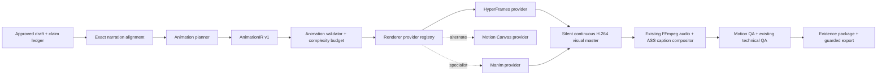

# Dark Curiosity Continuous Animation Architecture

Status: Slice C1 semantic-timing benchmark validated; production migration not approved

Decision target: `continuous_motion_renderer_v1`

Date: 2026-07-13

## 1. Decision

Replace the current sparse PNG-keyframe slideshow path for Dark Curiosity with a continuous, frame-addressable 2D vector renderer. Keep the existing content approval, narration, exact word alignment, captions, FFmpeg normalization, technical QA, evidence packaging, and publish guard.

Use HyperFrames as the first rendering-shell candidate, pinned behind an engine-owned contract. Compile strict `AnimationIR` into engine-owned HTML/SVG/Canvas scenes with a seekable WAAPI or custom interpolation timeline. Do not let generated story content depend directly on HyperFrames, Motion Canvas, GSAP, or renderer-specific APIs. Motion Canvas remains the strongest dedicated explanatory-animation benchmark, but its older public release cadence makes it a risky sole production dependency.

Manim Community can later be added as a specialist provider for math-heavy or geometric scenes, but it should not be the primary Dark Curiosity renderer. The original 3b1b ManimGL repository is a style and motion reference, not the production dependency. HyperFrames is new and pre-1.0, so the first slice is a benchmark and compatibility spike—not an immediate production switch.

## 2. Why the current visual path looks static

The current renderer:

1. compiles narration and storyboard data into `TimelineIR`;
2. selects roughly three frames per scene through `planDarkCuriosityKeyframes()`;
3. starts a separate headless Chrome screenshot process for every selected frame;
4. asks FFmpeg concat to hold each PNG until the next selected frame.

The SVG functions contain interpolated state, but almost none of those intermediate states reach the video. A 34-second short can therefore contain only about 15 unique visual frames. More SVG detail or more effects will not solve that structural problem.

## 3. Target qualities

- continuous 30 fps motion, not held keyframes;
- one visual idea introduced at a time;
- object permanence across explanations: an object should transform or move instead of disappearing and being replaced without reason;
- draw-on paths, morphs, animated graphs, camera framing, staggered labels, and causal diagrams;
- deterministic renders from the same approved input, versions, assets, and seed;
- a distinct Dark Curiosity visual identity inspired by explanatory-animation principles, without copying 3Blue1Brown branding, characters, or signature assets;
- bounded render time and memory on an Apple Silicon development machine;
- no arbitrary AI-generated JavaScript, Python, SVG, shaders, or shell commands.

## 4. Target pipeline



The renderer owns only the moving visual master. The existing engine remains the authority for narration audio, captions, loudness, output format, QA, provenance, and release.

## 5. New contracts

### 5.1 `AnimationIR v1`

`AnimationIR` is a declarative, renderer-neutral artifact bound to the approved draft, exact alignment, asset manifest, renderer profile, and deterministic seed.

Required top-level fields:

- `schemaVersion`, `profile`, `profileVersion`;
- `projectId`, `projectRevision`, `verticalId`;
- `fps`, `width`, `height`, `durationFrames`;
- `draftHash`, `alignmentHash`, `assetManifestHash`;
- `rendererProvider`, `rendererVersion`, `styleSystemVersion`;
- `seed`;
- `scenes`, `sharedEntities`, `transitions`, `motionBudget`;
- `contentHash`.

Each scene contains:

- exact `startFrame` and `endFrame`;
- a template family and version;
- semantic entities with stable IDs;
- layer ordering;
- allowlisted animation operations;
- word, beat, or absolute-frame timing anchors;
- camera cues;
- disclosure and evidence bindings;
- an explicit complexity cost.

Example operation:

```json
{
  "op": "draw_path",
  "targetId": "wow_signal_wave",
  "from": { "anchor": "beat_start", "offsetFrames": 2 },
  "to": { "anchor": "word_end", "wordIndex": 8 },
  "easing": "ease_in_out_cubic",
  "params": { "direction": "left_to_right", "overshoot": 0 }
}
```

Allowlisted v1 operations:

- `create`, `remove`, `fade`, `transform`, `morph_path`;
- `draw_path`, `trace_signal`, `reveal_mask`;
- `move`, `scale`, `rotate`, `pulse`, `stagger`;
- `count`, `plot`, `connect`, `highlight`, `focus`;
- `camera_pan`, `camera_push`, `camera_pull`, `camera_track`;
- `particle_field`, `ambient_drift`, `noise_modulate`;
- `transition_match`, `transition_wipe`, `transition_dissolve`.

All operations use a small easing allowlist and bounded numeric ranges. Every target must refer to a declared semantic entity.

### 5.2 Renderer provider contract

```text
doctor() -> bounded readiness
validate(animationIR) -> validated render request
estimate(request) -> frames, cost, memory, expected duration
render(request, signal, onProgress) -> visual master manifest
verify(manifest) -> hash-bound technical result
```

The provider runs as a child process or isolated worker. It receives managed JSON paths, writes only inside its assigned staging directory, supports cancellation, emits bounded JSON progress, and never receives secrets.

### 5.3 Visual master manifest

Replace `keyframes-manifest.json` as the production handoff with:

- visual MP4 artifact ID and SHA-256;
- width, height, fps, frame count, duration, codec, and pixel format;
- `AnimationIR` hash;
- provider, runtime, template, and style-system versions;
- deterministic seed and asset hashes;
- per-scene frame ranges and render timings;
- warnings and fallback codes;
- `continuousMotion: true`.

## 6. HyperFrames provider and visual runtime

### 6.1 Why it is the first rendering-shell candidate

HyperFrames is TypeScript/Node-based and turns seekable HTML, CSS, SVG, Canvas, Lottie, or Three.js animation into deterministic MP4 through headless Chrome and FFmpeg. Its engine/producer separation, per-frame seeking, progress-aware CLI, Apache-2.0 license, and Node 22 requirement align closely with the current engine. It replaces the fragile custom “one Chrome process per screenshot plus PNG concat” layer without forcing React or a second Python runtime.

HyperFrames does not create a 3Blue1Brown-like visual language by itself. The engine still needs its own semantic scene library, style system, animation planner, and QA. Use the strictly OSS path—WAAPI or engine-owned interpolation—during the benchmark. GSAP can be evaluated separately only after its non-OSI license is explicitly accepted.

The provider should live under:

```text
renderer/hyperframes/
  render-worker.mjs
  animation-ir-adapter.ts
  style-system.ts
  primitives/
  templates/
  tests/
```

Do not start a fresh browser for every frame. Start one bounded render job, load one compiled composition, seek every frame deterministically, and render the whole frame range continuously. Reuse a browser only within the job boundary; always wait for child-process exit before cleanup. Pin the exact pre-1.0 package versions and wrap every public API behind the provider contract.

Motion Canvas remains an alternate provider and an important reference implementation because it is explicitly designed for informative vector animation synchronized with voice-over. If HyperFrames cannot meet the visual or determinism benchmark, the same `AnimationIR` must be rendered through a pinned Motion Canvas adapter without changing approved content artifacts.

### 6.2 Scene template families

Initial templates should solve recurring explanatory needs rather than one specific story:

1. `signal_lab_v1`: waveform trace, spectrogram-like grid, interference, beam crossing, signal decay;
2. `evidence_graph_v1`: evidence nodes, source badges, confidence edges, contradiction states;
3. `causal_system_v1`: entities connected through animated flows and transformations;
4. `timeline_map_v1`: time cursor, route drawing, geographic focus, layered discoveries;
5. `scale_compare_v1`: animated quantities, ratios, zoom from local to global scale;
6. `mystery_payoff_v1`: competing hypotheses converge into a bounded conclusion.

Every scene exposes semantic slots, not arbitrary coordinates. The planner chooses a template and fills slots; the template owns layout and motion choreography.

### 6.3 Style system

Version and test the visual identity separately from content:

- dark navy background with restrained texture and depth;
- cyan for observation/data, amber for uncertainty or payoff, violet for relationships;
- geometric sans-serif typography distinct from 3Blue1Brown;
- consistent line widths, node radii, shadows, glow limits, and safe zones;
- camera movement capped to avoid motion sickness;
- subtle ambient motion in every scene, but only one dominant motion at a time;
- transitions based on a shared visual object whenever possible.

Define three intensity profiles:

- `calm_explainer`: 0.35–0.55 normalized motion energy;
- `dark_curiosity`: 0.50–0.75;
- `high_intensity_mystery`: 0.65–0.85 with stricter jerk and text-readability limits.

## 7. Animation planning

The model may propose only a declarative plan. It must not generate executable renderer code.

Planning stages:

1. identify the visual claim of each spoken beat;
2. reuse or introduce semantic entities;
3. select one allowlisted scene template;
4. map operations to exact word/beat anchors;
5. assign an intensity curve and camera cue;
6. validate evidence/disclosure requirements;
7. reject plans exceeding scene or total complexity budgets;
8. deterministically compile the accepted plan to `AnimationIR`.

Fallback is an engine-owned safe template. It must never fall back to random stock footage or unverified AI imagery.

## 8. Transitions and smoothness

Smoothness is not simply higher FPS. The engine needs continuity rules:

- shared entity IDs across adjacent scenes;
- velocity-aware position interpolation;
- match cuts between equivalent geometry;
- no more than one camera move and two foreground transformations at once;
- minimum readable hold after important text resolves;
- bounded easing derivatives to prevent sudden acceleration;
- 6–15 frame transition overlap depending on scene density;
- captions remain outside the renderer and reserve a fixed lower safe zone.

The compositor must consume the continuous visual master directly. It must not convert the animation back into a sparse PNG concat.

## 9. Motion QA

Extend the existing QA with motion-specific gates:

- `MOTION_CONTINUITY_VALID`: no unintended frame jumps at scene boundaries;
- `MOTION_STASIS_IN_RANGE`: excessive static-frame ratio is blocked;
- `MOTION_ENERGY_IN_RANGE`: optical-flow energy matches the selected profile;
- `MOTION_JERK_IN_RANGE`: acceleration discontinuities stay bounded;
- `MOTION_TEXT_READABLE`: important text receives sufficient low-motion hold time;
- `MOTION_CAPTION_SAFE`: visual entities do not enter the caption safe zone;
- `MOTION_CAMERA_SAFE`: pan/zoom velocity and scale stay within limits;
- `MOTION_OBJECT_PERSISTENCE`: matched semantic entities do not teleport;
- `MOTION_RENDER_DETERMINISTIC`: sampled-frame hashes match on a repeated proof render.

Use FFmpeg for frame extraction and OpenCV optical flow for metrics. Run a fast sampled preview gate first and full final QA only after approval.

## 10. Repository evaluation

| Repository | Use | License | Fit | Decision |
|---|---|---:|---|---|
| [heygen-com/hyperframes](https://github.com/heygen-com/hyperframes) | Deterministic HTML/SVG/Canvas-to-video shell using Puppeteer and FFmpeg | Apache-2.0 | Closest match to the current Node/Chrome/FFmpeg architecture; supports seekable animation adapters | First benchmark and likely core shell; pin exact v0.x version because API churn is the main risk |
| [motion-canvas/motion-canvas](https://github.com/motion-canvas/motion-canvas) | TypeScript vector animation and voice-over synchronization | MIT | Best conceptual match for informative 2D animation | Alternate provider/reference; do not make it the sole core while the public release cadence is stale |
| [ManimCommunity/manim](https://github.com/ManimCommunity/manim) | Mathematical and geometric animation | MIT dual copyright notices | Excellent primitives; heavier Python/Cairo/LaTeX runtime and a second production stack | Optional specialist provider after v1 |
| [3b1b/manim](https://github.com/3b1b/manim) | Original ManimGL used as a motion-language reference | MIT | Closest inspiration, but a personal-tool workflow with OpenGL and less production isolation | Do not make it the core dependency |
| [remotion-dev/remotion](https://github.com/remotion-dev/remotion) | Frame-addressed React video rendering | Special free/company license | Very active, mature renderer API, strong progress/cancellation support | Strong fallback, but avoid making it mandatory until licensing strategy is accepted |
| [theatre-js/theatre](https://github.com/theatre-js/theatre) | Visual/programmatic motion tuning | Core Apache-2.0; Studio AGPL-3.0 | Useful for manually tuning reusable templates | Optional development tool; not runtime authority while public 1.0 work is pending |
| [rive-app/rive-wasm](https://github.com/rive-app/rive-wasm) | Runtime for designer-authored Rive assets | MIT runtime | Good for reusable animated assets, not automatic story composition | Optional asset provider |
| [LottieFiles/dotlottie-web](https://github.com/LottieFiles/dotlottie-web) | Canvas playback of Lottie/dotLottie assets | MIT | Good for icons and reusable accents; weak as full narrative renderer | Optional asset provider |

License notes are architectural screening, not legal advice. Pin the exact dependency version and record license text and artifact provenance during implementation.

## 11. Migration slices

### Slice A — Contract and benchmark

- add strict `AnimationIR v1`, provider contract, doctor, and complexity estimator;
- build a 10-second Wow Signal HyperFrames benchmark using only engine-owned SVG and seekable WAAPI/custom interpolation;
- render continuous 720×1280 and 1080×1920 samples, then run the same `AnimationIR` through a small Motion Canvas adapter only if HyperFrames misses a target;
- measure render time, peak memory, deterministic hashes, and optical flow;
- make no change to the production pilot yet.

Exit: the benchmark visibly contains continuous path drawing, object morphing, camera motion, and a smooth transition, with no sparse-frame concat.

### Slice B — HyperFrames provider

- pin the HyperFrames packages and Node 22 runtime;
- implement isolated render worker, progress, timeout, cancellation, cleanup, and manifest verification;
- create `signal_lab_v1` and `mystery_payoff_v1`;
- keep existing PNG renderer as an explicit fallback.

### Slice C — Planner and timing

- compile aligned words/beats into animation anchors;
- add semantic entity reuse and transition matching;
- reject arbitrary operations and excessive complexity;
- create deterministic golden `AnimationIR` fixtures.

Slice C1 completed on 2026-07-13. A strict, hash-bound `TimingContext` now compiles exact narration words and beats into resolved render frames. The renderer consumes only the compiled schedule, while templates continue to own geometry and visual style. The Wow Signal proof also replaces the prior opacity-only approximation with a deterministic 128-point waveform-to-node path morph.

### Slice D — Remaining templates

- add evidence graph, causal system, timeline/map, and scale comparison;
- add shared style tokens and three intensity profiles;
- add asset license/provenance manifests.

### Slice E — Motion QA

- optical-flow, stasis, jerk, safe-zone, clipping, and deterministic sample gates;
- visual contact sheets plus short animated proof clips for operator review;
- calibrate thresholds on at least ten fixtures, including adversarial cases.

### Slice F — Pilot switch

- register `motion_canvas_v1` in the renderer provider registry;
- make the Dark Curiosity pilot run side-by-side old vs. new;
- switch default only after technical gates pass and human reviewers consistently prefer the new render;
- retain one-release rollback to the SVG keyframe provider.

## 12. Acceptance criteria

The new renderer is not accepted because it “looks cooler.” It is accepted only if:

- a 30–40 second final contains continuous unique-frame motion rather than held PNGs;
- 1080×1920 final render completes within 6 minutes on the current Apple Silicon machine;
- peak renderer memory stays below 4 GiB;
- repeated renders from identical inputs have identical `AnimationIR`, sampled-frame hashes, and output metadata;
- no scene exceeds caption safe zones or clips required text;
- all existing narration, rights, evidence, QA, and publish gates remain intact;
- blind human comparison prefers the animated version in at least 8 of 10 evaluated fixtures;
- no provider-specific code or generated executable content enters approved story artifacts.

## 13. Current validation and next implementation task

Slice A completed on 2026-07-13. The provider-neutral contract, isolated HyperFrames provider, engine-owned custom interpolation runtime, 10-second Wow Signal benchmark, manifest, contact sheet, and sampled motion gates are implemented. Corrected 720×1280 and 1080×1920 renders passed their declared technical thresholds; a repeated 720p render produced identical `AnimationIR`, composition, sampled decoded-frame, and MP4 hashes.

Slice C1 completed on 2026-07-13. The compiler now resolves absolute, beat-start, beat-end, word-start, and word-end anchors against an exact alignment-bound timing context. All twelve proof operations carry validated inclusive render ranges, and changing one aligned word boundary changes only its dependent operation and the resulting `AnimationIR` hash. HyperFrames receives this resolved schedule without narration text, paths, storage keys, or provider output. The signal waveform is resampled to 128 deterministic points and interpolated into topology-compatible node geometry; seeking frame N, then M, then N recreates the same engine-owned morph state hash.

The corrected 720×1280 proof contains exactly 300 H.264/yuv420p frames at 30 fps. It rendered in 14.701 seconds with 160 MiB peak renderer memory. All declared technical, diversity, safe-zone, clipping, semantic-timing, alignment-sensitivity, and morph checks passed. Active morph energy was 0.006095 versus 0.000231 during the readability hold. Sampled stasis was 13.79%, which passes the current 15% bound but is too close to treat the threshold as calibrated.

This result keeps HyperFrames approved for benchmark work, not as the production default. The existing SVG keyframe renderer remains unchanged. The next bounded slice should add pixel/OCR clipping checks, jerk and continuity metrics, external-request instrumentation, and adversarial timing fixtures before expanding the remaining template families. A browser-level reverse-seek integration test should supplement the deterministic primitive-state proof, and motion thresholds must be calibrated across at least ten fixtures. The lower caption reserve also needs compositional refinement so it remains safe without looking visually empty.

## Primary references

- Motion Canvas repository and documentation: https://github.com/motion-canvas/motion-canvas and https://motioncanvas.io/docs/
- HyperFrames repository, packages, and license: https://github.com/heygen-com/hyperframes, https://github.com/heygen-com/hyperframes/tree/main/packages, and https://github.com/heygen-com/hyperframes/blob/main/LICENSE
- Manim Community repository and documentation: https://github.com/ManimCommunity/manim and https://docs.manim.community/
- Original ManimGL repository: https://github.com/3b1b/manim
- Remotion repository, license, and renderer API: https://github.com/remotion-dev/remotion, https://github.com/remotion-dev/remotion/blob/main/LICENSE.md, and https://www.remotion.dev/docs/renderer/render-media
- Theatre.js repository: https://github.com/theatre-js/theatre
- Rive Web runtime: https://github.com/rive-app/rive-wasm
- dotLottie Web runtime: https://github.com/LottieFiles/dotlottie-web
