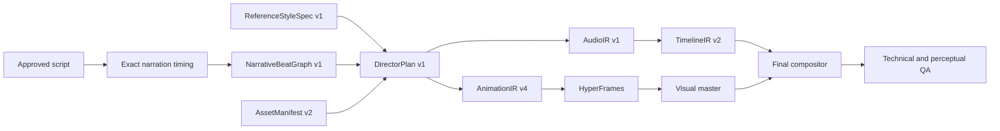

# Educational Explainer v1

`educational-explainer-v1` is an opt-in narrated-short profile that targets
high-density, line-art educational storytelling while preserving the existing
approval, exact-alignment, evidence, QA, export, and publish guards.

It is inspired by the production grammar of the canonical reference Reel, not
by its assets or branding. Every shipped visual and audio asset is either
first-party engine output or a locally licensed dependency.

## Deterministic artifact chain



The semantic planner may choose only bounded intent, layout, recipe,
transition, typography role, and sparse audio-cue intent. Geometry, visible
text, timing, local assets, hashes, and executable rendering stay engine-owned.

## Runtime guarantees

- Promise/title is present from frame zero.
- The overview resolves by three seconds.
- A visual state or focus state changes at most every three seconds.
- Semantic typography is rendered in HyperFrames; ASS captions remain a
  compatibility fallback and the full transcript remains an export artifact.
- `promise_header` and `story_thread` persist across every scene.
- The renderer has no remote requests and accepts only the exact schema/profile/
  renderer/style tuple.
- The FFmpeg compositor applies AudioIR deterministically: normalized narration
  plus sparse, engine-generated SFX locked to exact microbeat frames. Its music
  track is explicitly disabled until a rights-cleared asset is installed and
  approved.

## API

Preplan or render with:

```json
{
  "animationProfile": "educational-explainer-v1",
  "styleSpecId": "educational_line_art_reference_v1"
}
```

`styleSpecId` is server-controlled. Unknown IDs are rejected. Existing payloads
and `semantic-v3` remain compatible.

The compiled/rendered chain exposes hashes and artifact IDs for
`ReferenceStyleSpec`, `NarrativeBeatGraph`, `DirectorPlan`, `AnimationIR`,
`AudioIR`, and `AssetManifest v2`.

## Rollout gate

The profile remains opt-in. Promotion to default requires ten complete
production chains, all technical gates passing, and at least eight human
side-by-side reviews scoring 4/5 or better for clarity, hierarchy, pacing,
polish, and originality.
