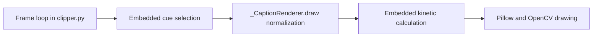
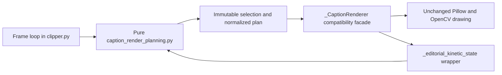

# Caption Render Planning Maintainability Slice

Date: 2026-08-05

## Provenance

- Base `main`: `33338d72cfa5de94370c0f2609fadf35f8057ae8`
- Final implementation: the head commit of `codex/maintainability-caption-render-planning` that contains this report; the exact immutable SHA is recorded in the pull request because a commit cannot embed its own hash.
- Branch: `codex/maintainability-caption-render-planning`
- Runtime: Node.js 24.16.0, npm 11.13.0, Python 3.13.0
- Prerequisite: `refactor: isolate lossless cut configuration` was merged into the base `main` before this branch was created.

## Audit findings

The per-frame caption behavior was split across three places in `clipper.py`:

- `_reframe_vertical` selected active cues and mutated the legacy `caption_index` scan cursor.
- `_CaptionRenderer.draw` normalized cue fields, applied typography defaults, invoked the kinetic patch point, and performed all Pillow/OpenCV drawing.
- `_editorial_kinetic_state` calculated the Budget Friendly entry/exit state and was directly imported or patched by tests.

The exact behavior characterized before extraction was:

- Cue start is inclusive and cue end is exclusive.
- Legacy selection advances only past ended cues, preserves gaps, and does not reorder or search past a future cue in unsorted input.
- Persistent editorial selection sorts by `sentence_phrase_index` and `phrase_id`, keeps the newest start in each `(sentence_id, caption_track_slot)`, limits the result to the latest two tracks, and restores editorial order.
- Persistent selection does not advance `caption_index`.
- Required `start`/`end` fields and numeric conversions retain their existing Python exceptions.
- Dictionary and plain-string cues retain their distinct defaults, conversions, filtering, and legacy uppercase behavior.
- `_render_elapsed` defaults to cue `start`; kinetic state is present only for the Budget Friendly editorial profile.
- `_CaptionRenderer.last_kinetic_state` remains observable, and `_editorial_kinetic_state` remains the renderer's monkeypatch target.

No import cycle was present or introduced. The new module imports only `typing`, while `clipper.py` imports the leaf planner.

## Architecture

Before:

After:

## Extracted boundary

`caption_render_planning.py` contains only deterministic, supplied-value transformations:

- `select_active_caption_cues`
- `editorial_kinetic_state`
- `build_caption_render_plan`
- small `NamedTuple` result types

It performs no drawing, text measurement, font lookup, filesystem or environment access, logging, subprocess work, or input mutation. Caption grouping, timing construction, layout, fonts, safe boxes, coordinates, pixel blending, frame iteration, FFmpeg, cache behavior, and render profiles remain in their previous owners.

`clipper.py` remains the compatibility facade. `_CaptionRenderer`, `_CaptionRenderer.draw`, `_editorial_kinetic_state`, `_render_elapsed`, `caption_index`, renderer state fields, and existing caller contracts are preserved.

## Size and complexity

| Measure | Before | After | Delta |
| --- | ---: | ---: | ---: |
| `clipper.py` | 7,590 LOC | 7,468 LOC | -122 |
| New planner module | 0 LOC | 218 LOC | +218 |
| Production Python | 30,098 LOC | 30,194 LOC | +96 |

The small positive total is the cost of explicit immutable result contracts, a separately testable selector, and a pure normalizer. The monolithic renderer facade shrank by 122 lines, the new module remains below the 250-line preference, and no dependency was added.

## Characterization-first evidence

Nine characterization tests passed against the original production implementation before any extraction. The final suite contains 15 tests covering boundaries, legacy cursor state, gaps and unsorted input, persistent ordering/deduplication/two-cue limit, absent fields, exact conversion failures, normalization, typography, uppercase and empty cues, kinetic values, `_render_elapsed`, renderer arguments/state, patch-point identity, input immutability, and leaf-module architecture.

After extraction:

- New characterization tests: 15/15 passed.
- Focused caption/profile/semantic/winner suite: 159/159 passed.
- Python compilation and `git diff --check`: passed.
- Import audit: planner is a standard-library leaf importing only `typing`.

Existing deterministic caption pixel assertions passed in the focused suite, including caption ROI parity and rendered pixel preservation tests. No new full decoded-video frame comparison was run, so this report does not claim independently proven pixel-identical complete videos.

## Baseline and final verification

| Gate | Baseline | Final |
| --- | --- | --- |
| Static lint | pass | pass |
| Build smoke | pass | pass |
| Node tests | 1,683 pass / 7 skip / 0 fail | 1,683 pass / 7 skip / 0 fail |
| Python discovery | 524/524 pass | 539/539 pass |
| Isolated Python modules | 53/53 pass | 54/54 pass |
| HookGate quality | 96.2981 | 96.2981 |
| Hard guardrails | pass | pass |
| Fixture fingerprint | `37ef626b9901ad2eeb1056d47954d88cdf2ede6430cc80e449bd5f9c7a91f9c9` | unchanged |
| Metric fingerprint | `d62ce934e038d9026263ce2be7efa5f0c6e3ffac8a583d7b23b609540a5f4fe9` | unchanged |

The full browser suite required normal host browser permissions because sandboxed Chrome terminated with `EPERM`; the same locked suite passed when rerun with those permissions.

`npm audit` reports five moderate transitive findings in `@hono/node-server`, `hono`, and `postcss`, with no high or critical finding. The forced Hono adapter remediation would move `@hyperframes/producer` outside its declared range and is intentionally outside this refactor. Generated test reports that changed timestamps or inserted local paths were restored and are not part of the diff.

## Behavior statement and limitations

This slice does not intentionally change caption selection, timing, typography, layout, drawing, pixels, FFmpeg arguments, cache behavior, logs, exceptions, or video output. It adds no provider, dependency, environment read, or import-time side effect.

The normalized plan is immutable at its outer `NamedTuple` boundary; it deliberately carries existing cue references and a typography mapping to preserve current caller behavior rather than introduce deep-copy semantics.

## Next safe slice

The next characterization-first slice should isolate caption cue grouping and timing planning only. It should first freeze phrase/sentence segmentation, hold/gap behavior, semantic closure, and timestamp boundaries, and must not be combined with font resolution, drawing, or render changes.
