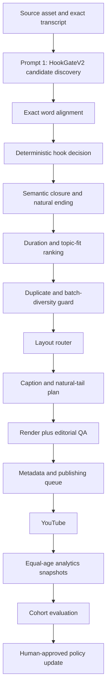

# Budget Friendly Growth Architecture V1

Status: architecture approved for incremental implementation.

Evidence scope: the 12 Shorts published during 2026, from 13–22 July.

Prompt 1 status: `HookGateV2` is integrated into the opt-in
`motivational_tension_micro_v2` candidate-discovery prompt without adding an
LLM roundtrip. Its deterministic exact-word decision gate is also integrated
after motivational boundary alignment. The immutable v1 production profile is
unchanged.

Stage 2 status: `semantic-closure-decision-v1.0.0` and
`natural-source-tail-v1.0.0` are integrated into `bf_growth_v2`. The closure
decision runs on exact timed words before ranking. The isolated
`bf_editorial_inset_v2` renderer uses `bf_natural_tail_v6`, which forbids
synthetic settle/freeze frames and starts its 130ms fade only after the sealed
authentic source endpoint. V1 remains unchanged.

Stage 3 status: `bf-growth-replay-v1.0.0` is implemented as a zero-LLM,
zero-render offline acceptance runner. The first replay covered six real 2026
sources, 95 candidates, and 18 human-approved positives. Closure-only ranking
achieved 77.78% precision among selected top-three slots, but filled only 50%
of planned slots and retained 61.11% of human positives. Legacy HookGateV2
evidence coverage was 0%, as expected, because these cached candidates predate
Prompt 1. Production promotion is therefore not approved; the v2 profile
remains shadow/opt-in.

Stage 4 status: `bf-growth-shadow-v1.0.0` now runs fresh discovery from cached
word-timed transcripts with hard guarantees of zero renders, zero uploads, and
zero production-policy mutations. The first `hook-gate-v2.0.0` pilot produced
complete HookGate evidence for 16/16 candidates but rejected all 16 because
every measured signal landed after 1.0s. Prompt `hook-gate-v2.1.0` now chooses
the hook signal first, anchors the opening to it, and requires a timing,
duration, and closure self-check. On the same source it produced complete
evidence for 14/14 candidates, raised closure acceptance from 37.5% to 64.29%,
and filled the closure-only top-three. A bounded 50ms caption-timing tolerance
in `hook-gate-decision-v1.1.0` admitted one full-V2 candidate; the other
candidates remain fail-closed. A versioned human-review queue is generated for
the eligible clip and top near misses. Production promotion remains blocked
until fresh human labels and at least five sources satisfy the gates.

## Objective

Turn the current renderer into a measured learning system that improves:

```text
feed choice -> continued viewing -> useful completion -> sharing/subscription
```

The system must improve selection and packaging without:

- cutting a speaker to satisfy a duration target;
- adding an LLM call for every new gate;
- trusting model self-scores over timed transcript evidence;
- changing several experiment variables at once;
- allowing analytics feedback to mutate production policy without review.

## 2026 Baseline

- 12 uploads;
- 13,794 public views;
- median 1,273 views;
- 8 of 12 above 1,000 views;
- six `claim | speaker` titles above 1,000 views;
- ten 15–21 second videos averaged 1,352.5 views;
- two videos above 30 seconds averaged 134.5 views;
- `Doing LESS...` generated five of the six subscribers attributed to 2026
  uploads in the available Studio report.

The first engineering priority is therefore the spoken hook. Duration,
rendering, metadata, publishing, and learning follow it in separate versioned
stages.

## Pipeline



## Architectural Rules

1. One concern owns each gate.
2. Expensive semantic work is batched; deterministic work is local.
3. Exact timed words override LLM claims.
4. A model may propose evidence, but Python decides eligibility.
5. Every policy and prompt is versioned and included in cache identity.
6. Missing evidence is `review`, never an implicit pass.
7. Natural semantic closure overrides the preferred duration.
8. Analytics compares videos at equal age and within compatible cohorts.
9. Production policy changes require an explicit experiment decision.

## Stage Contracts

### 0. Source and transcript

Inputs:

- immutable source hash;
- word-timed transcript;
- source metadata and speaker;
- profile bundle.

Existing artifacts:

- `SourceAssetManifest`;
- `TranscriptManifest`.

Failure behavior:

- fail closed when exact timing or source identity is unavailable for a
  production decision;
- discovery may continue for preview-only output, but may not be approved.

### 1. Prompt 1 — HookGateV2

Placement:

- injected only when the opt-in v2 motivational micro profile is selected;
- no second LLM call;
- processed per transcript/chunk in the current concurrency model.

New candidate evidence:

- `opening_exact_quote`;
- `hook_signal_phrase`;
- `hook_family`;
- `new_viewer_understands_opening`;
- `opens_with_context_connector`;
- `contains_external_antecedent`;
- `contains_host_setup`;
- `first_second_value_score`;
- `specificity_score`;
- `relatability_score`;
- `stop_scroll_score`;
- `hook_gate_recommendation`;
- `hook_gate_reasons`;
- `hook_gate_response_complete`;
- `hook_gate_pass_evidence_complete`;
- prompt and schema versions stamped by Python.

The LLM recommendation is advisory. The deterministic
`hook-gate-decision-v1.1.0` stage now verifies:

- exact opening alignment;
- exact hook-signal alignment and measured first-second latency;
- exact hook-payoff alignment;
- signal latency targeting 1.0 seconds, with only a bounded 50ms caption-timing
  measurement tolerance;
- payoff latency at or below 3.0 seconds;
- no connector, attribution, host setup, or external antecedent;
- no missing context;
- no generic motivation without specific tension.

Matching is source-contiguous and strictly bounded by the selected speech
interval. The older ±3-second alignment fallback remains available to v1
boundary refinement but cannot satisfy HookGateV2.

Decision outputs:

- `hook_gate_status`: `pass | reject | review`;
- `hook_gate_eligible`;
- `hook_gate_decision_version`;
- exact opening, signal, and payoff timestamp spans;
- measured signal and payoff latency;
- stable reject/review reason codes;
- the active thresholds copied into the candidate artifact.

V2 ranking fails closed when this decision is absent or its version does not
match the selected profile. Missing word timing produces `review`, never
`pass`.

### 2. Semantic closure and duration

Implemented policy:

- 15–21 seconds receives the preferred duration score;
- 22–25 seconds receives a soft penalty;
- above 25 seconds requires hook, payoff, self-contained-arc, and closure
  scores of at least 85, otherwise it is routed to review;
- above 30 seconds is rejected by default;
- required semantic continuation is retained even when it exceeds the preferred
  range;
- the candidate is rejected rather than truncated when the complete point
  cannot fit the hard production limit.

Decision evidence:

- exact closing quote and exact word span;
- sealed speech start/end and speech duration;
- stable `pass | reject | review` status and reason codes;
- duration bucket and deterministic fit score;
- next spoken-word onset and 40ms safety guard;
- authentic natural-tail start/end, capped at 750ms;
- caption source endpoint equal to the sealed speech endpoint;
- post-source fade start and duration;
- `freeze_hold_seconds = 0`.

V2 ranking fails closed when the closure decision is absent, non-passing, or
version-mismatched. This stage owns speech boundaries. The V2 renderer must
consume the sealed endpoint and may not invent a longer speaker hold, freeze a
frame, extend black video, or admit the first word of the next phrase.

### 3. Topic and originality

Planned evidence:

- audience pillar;
- sensitive-topic risk;
- technical-jargon score;
- relatable framing;
- speaker identity/popularity bucket;
- similarity to recently published hooks, theses, and source intervals.

Sensitive or technical source material is routed to title/framing review before
being rejected. Near-duplicate source intervals fail closed.

### 4. Layout router

Planned inputs:

- duration bucket;
- face coverage and motion;
- source aspect/quality;
- speaker identity/popularity bucket;
- experiment treatment.

Initial routing:

- short, expressive, recognizable-speaker clips may use editorial inset;
- clips above 18 seconds, low-motion sources, or less recognizable speakers
  default to full-screen/face-first;
- layout is stored as an experiment variable.

### 5. Caption and tail planning

Planned caption gates:

- 3–5 words per block;
- 450–600 ms minimum full-block visibility;
- one emphasized word;
- no caption after acoustic speech end.

Implemented V2 tail:

```text
complete speech -> authentic source breath/reaction -> 130 ms fade
```

The brand mark is a live watermark or a maximum 200–300 ms card. QA measures
acoustic end, next-word safety, final caption time, freeze duration, first black
frame, and fade start.

For the current BF card experiment, the existing 850ms branded hold remains
versioned separately from the speech/source landing. It is not counted as
speaker breathing room.

### 6. Metadata and publishing

Planned metadata gates:

- claim-led or `claim | speaker` title;
- no `#Shorts` in the title;
- no internal `bf_*` tags;
- sensitive/jargon rewrite review;
- upload the engine's timed SRT/VTT track.

Publishing policy:

- one default release per day;
- at least six hours between releases;
- no same-speaker/source collision on the same day;
- schedule through private plus `publishAt`;
- idempotency remains mandatory.

### 7. Analytics and learning

Existing equal-age gates:

- 1, 6, 24, 72, 168, and 672 hours.

Primary metrics:

- stayed to watch;
- average percentage viewed;
- engaged views;
- shares/comments per 1,000 engaged views;
- subscribers per 1,000 engaged views.

Policy:

- collect automatically once YouTube Analytics access is available;
- compare only equal-age, compatible cohorts;
- do not promote a policy from one breakout;
- require a minimum cohort size and human approval;
- preserve every experiment manifest and decision.

## Prompt Sequence

Only Prompt 1 is implemented in this iteration.

1. `HookGateV2`: discovery and first-second evidence, batched into the existing
   candidate call.
2. `TopicFramingV1`: future, only for sensitive/jargon/title routing.
3. `OriginalEditorialLayerV1`: future, creates source-supported original context
   or an actionable channel takeaway.
4. `MetadataV2`: future, produces the final claim-led title and description.

Semantic timing, duration, layout, captions, tail, publishing, and analytics
remain deterministic or configuration-driven; they do not each receive an LLM
prompt.

## Cache and Versioning

- Prompt 1 carries `hook-gate-v2.1.0`.
- Python stamps `hook_gate_schema_version=2`.
- Deterministic decisions carry `hook-gate-decision-v1.1.0`.
- Semantic endpoints carry `semantic-closure-decision-v1.0.0`.
- Authentic source tails carry `natural-source-tail-v1.0.0`; render output
  carries `bf_natural_tail_v6`.
- The discovery prompt contract already participates in cache identity.
- Adding HookGateV2 therefore invalidates incompatible discovery/candidate
  responses for v2 without deleting or changing v1 caches.
- Future threshold changes that do not change prompt evidence should version the
  deterministic policy, not force another LLM call.

## Failure Cases

| Failure | Result |
| --- | --- |
| Invalid JSON | Existing bounded retry |
| Missing HookGate fields | `review`, never pass |
| Exact quote does not align | Deterministic reject |
| Model says pass but context/timing fails | Deterministic reject |
| Closing quote is absent or not exact | `review` or deterministic reject |
| Required continuation exceeds 30s | Reject the candidate; never truncate |
| 25–30s clip lacks exceptional evidence | `review`, never automatic pass |
| Next word begins immediately | Zero invented hold; fade after the sealed endpoint |
| V2 renderer receives no closure seal | Render fails closed |
| Renderer reports a freeze/settle frame | QA failure |
| Too few qualified candidates | Existing near-miss refinement/fallback |
| Analytics snapshot incomplete | Excluded from primary decision |
| Cohort too small | Continue collecting |
| Policy winner depends on one breakout | Human review, no automatic promotion |

## Rollout

1. ✅ Capture HookGateV2 evidence in discovery output.
2. ✅ Add deterministic alignment and rejection reasons.
3. ✅ Replay cached 2026 fixtures and compare recall/top-three acceptance.
4. 🟡 Run fresh HookGateV2 discovery in shadow mode, obtain human labels, and
   rerun acceptance until hook-evidence coverage, closure recall, precision,
   and batch-fill gates pass. The one-source pilot and review queue are
   complete; multi-source coverage and human decisions remain.
5. ✅ Implement duration/closure policy and the zero-freeze natural-source tail.
6. Complete caption-block QA and layout routing.
7. Connect publishing and analytics automation.

Every rollout step must preserve existing non-motivational profiles and pass the
full regression suite.
